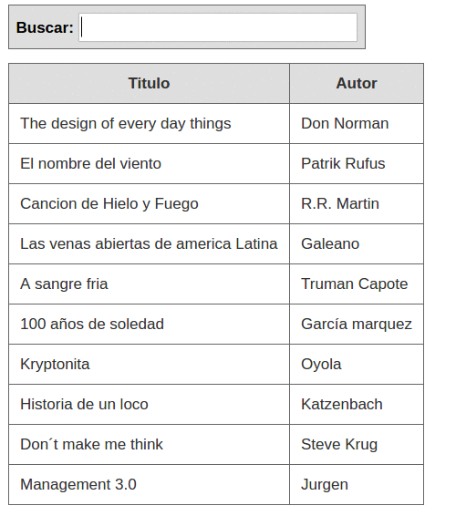

# Búsqueda de libros - client side en Angular

Tenés además estas opciones para hacer la búsqueda mediante un servicio REST

* contra Play2 (histórico): [libros-backend-play/](https://xp-dev.com/svn/uqbar/examples/ui/web/angular/libros-backend-play/)
* contra Sparkler: [libros-backend-sparkler/](https://xp-dev.com/svn/uqbar/examples/ui/web/angular/libros-backend-sparkler/)
* en el master de este repositorio se trabaja contra un servicio XTrest: [libros-angular-xtrest/](https://xp-dev.com/svn/uqbar/examples/ui/web/angular/libros-angular-xtrest/) (aplicación completa)
